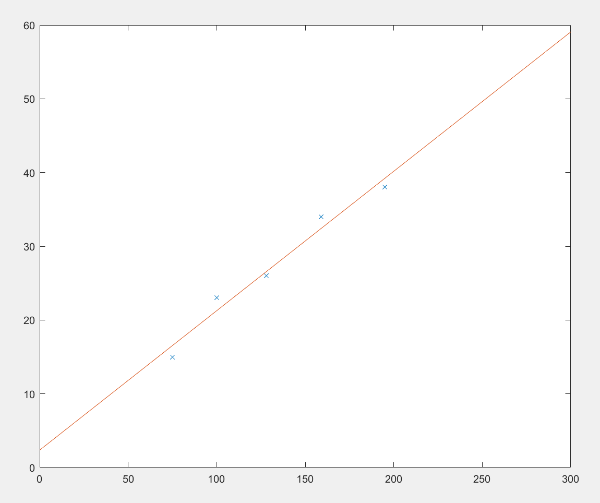

# MATLAB HW 5


## Exercise 5.1

a.


The maximum number of non-zero orthogonal vectors possible in $\mathbb{R}^{3}$ is 3, since there are only 3 dimensions.

For $\mathbb{R}^{n}$ there can be $n$ non-zero orthogonal vectors, since to have a higher count of orthogonal vecors, you need to add more dimensions into each vector

```Matlab
>> v = [2; 0; -1]

v =

     2
     0
    -1

>> w = [1; 3; 3]

w =

     1
     3
     3

>> x = [6; 1; -3]

x =

     6
     1
    -3

>> y = [1; 0; 2]

y =

     1
     0
     2

>> z = [2; -15; -1]

z =

     2
   -15
    -1

>> dot(v, y)

ans =

     0

>> dot(w, x)

ans =

     0

>> dot(x, y)

ans =

     0

>> dot(x, z)

ans =

     0


>> dot(y, z)

ans =

     0
```

Those are all the orthogonal sets, producing {$v, y$}, {$w, x$}, and {$x, y, z$}

b.

```Matlab
>> X = x/norm(x)

X =

    0.8847
    0.1474
   -0.4423

>> Y = y/norm(y)

Y =

    0.4472
         0
    0.8944

>> Z = z/norm(z)

Z =

    0.1319
   -0.9891

>> W = [X Y Z]

W =

    0.8847    0.4472    0.1319
    0.1474         0   -0.9891
   -0.4423    0.8944   -0.0659
```

<br/><br/>

## Exercise 5.2

a.

```Matlab
>> W'*W

ans =

    1.0000         0         0
         0    1.0000         0
         0         0    1.0000
```
This is a $3 \times 3$ identity matrix, and we should expect this result because we just took the dot product of two orthogonal matrixes with each vector being a unit vector

<br/><br/>

b.

```Matlab
>> norm(b)

ans =

    3.6056

>> norm(W*b)

ans =

    3.6056
```

Multiplying b and W when computing the norm does not affect the result because the 
normalization of W is 1

```Matlab
>> dot(a,b)

ans =

     2

>> dot(W*a, W*b)

ans =

     2
```

The same can be seen for these two

<br></br>

c.

```Matlab
>> invW = inv(W)

invW =

    0.8847    0.1474   -0.4423
    0.4472         0    0.8944
    0.1319   -0.9891   -0.0659

>> WT = W'

WT =

    0.8847    0.1474   -0.4423
    0.4472         0    0.8944
    0.1319   -0.9891   -0.0659
```

They are identical

<br/><br/>

## Exercise 5.3


a.

```Matlab
>> v = [2; 0; -1];
>> w = [1; 3; 3];
>> vbar = (dot(v, w)/dot(w, w))*w

vbar =

   -0.0526
   -0.1579
   -0.1579

>> z = v - vbar

z =

    2.0526
    0.1579
   -0.8421

>> vbar + z

ans =

     2
     0
    -1
```

b.

```Matlab
>> dot(vbar, z)

ans =

  -2.7756e-17
```

The number is so small that it can be seen as zero, due to the tiny amount of error 
Matlab has, so therefore they are orthogonal

<br/><br/>

## Exercise 5.4

``` Matlab
>> x = [6; 1; -3];
>> y = [1; 0; 2];
>> v = [3 3 3]'

v =

     3
     3
     3

>> projvx = (dot(v, x)/dot(x, x))*x

projvx =

    1.5652
    0.2609
   -0.7826

>> projvy = (dot(v, y)/dot(y, y))*y

projvy =

    1.8000
         0
    3.6000

>> vbar = projvx + projvy

vbar =

    3.3652
    0.2609
    2.8174
```

<br/><br/>

## Exercise 5.5

a.

```Matlab
>> A = [[1, 2, 1]', [2, 1, 2]', [1, 1, 2]']

A =

     1     2     1
     2     1     1
     1     2     2

>> [Q,R] = qr(A)

Q =

   -0.4082    0.5774   -0.7071
   -0.8165   -0.5774   -0.0000
   -0.4082    0.5774    0.7071


R =

   -2.4495   -2.4495   -2.0412
         0    1.7321    1.1547
         0         0    0.7071
```

b.

```Matlab
>> v = eig(Q)

v =

  -0.6392 + 0.7690i
  -0.6392 - 0.7690i
   1.0000 + 0.0000i

>> norm(v(2))

ans =

    1.0000

>> norm(v(3))

ans =

    1.0000
```

The result for the second and third are identical

<br/><br/>

## Exercise 5.6

a.

```Matlab
>> B = [1 75; 1 100; 1 128; 1 159; 1 195]

B =

     1    75
     1   100
     1   128
     1   159
     1   195

>> d = [15; 23; 26; 34; 38]

d =

    15
    23
    26
    34
    38

>> [Q, R] = qr(B,0)

Q =

   -0.4472   -0.5950
   -0.4472   -0.3313
   -0.4472   -0.0359
   -0.4472    0.2912
   -0.4472    0.6710


R =

   -2.2361 -293.8193
         0   94.7903

>> x = Q(:, 1)

x =

   -0.4472
   -0.4472
   -0.4472
   -0.4472
   -0.4472

>> y = Q(:, 2)

y =

   -0.5950
   -0.3313
   -0.0359
    0.2912
    0.6710

>> v = dot(x,d)*x + dot(y,d)*y

v =

   16.5379
   21.2640
   26.5572
   32.4176
   39.2232
```

b.

```Matlab
>> c = B\v

c =

    2.3596
    0.1890

>> B*c - v

ans =

   1.0e-14 *

    0.3553
         0
    0.3553
    0.7105
         0
```

Yes, the answer is zero, since $\times10^{-14}$ is very close to zero, so it can be 
seen as a rounding error by Matlab
<br></br>

c.

```Matlab
>> cl = lscov(B, d, eye(5))

cl =

    2.3596
    0.1890
```

The answer is identical to $c$

<br/><br/>

## Exercise 5.7

a.

The equation is $y = 0.189 x + 2.3596$
<br></br>

b.

| Temperature | Pressure |
| ----------- | -------- |
| 35 F        | 8.9746   |
| 170 F       | 34.4896  |
| 290 F       | 57.1696  |

<br></br>
c.

```Matlab
>> x = B(:,2);
y = d;
t = 0:1:300;
z = polyval([c(2);c(1)],t);;
plot(x,y,'x',t,z)
```


